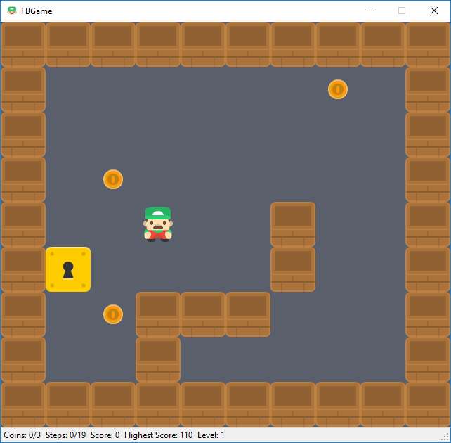

# FBGame
2D top-down puzzle game inspired by Sokoban

## Description
This program is a 2D top-down puzzle game with a pinch of reflection. The main protagonist of the game is lost in a maze. Coins are placed inside the maze alongside a safe and the player’s objective is to collect all the coins and place them in the safe. However, the player is limited to a certain number of steps and the game is lost when the maximum number of steps is reached.
